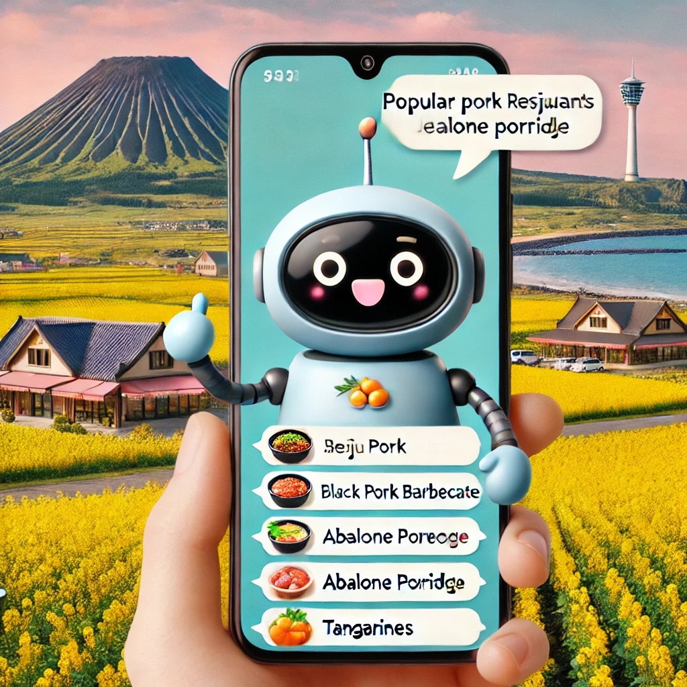

# Hot Place Recommendation Chatbot in Jeju Ireland using LLM & RAG

* Award in 2024 Bigcontest Generative-AI Session

## Introduction

This chatbot is a service that recommends famous restaurants in Jeju Island. Based on the data provided by Shinhan Card, we classify hot places and cool places and recommend them. When users ask questions that fit the situation, we recommend famous restaurants and hidden restaurants according to the context. We implemented this service by using the RAG technique and LLM.